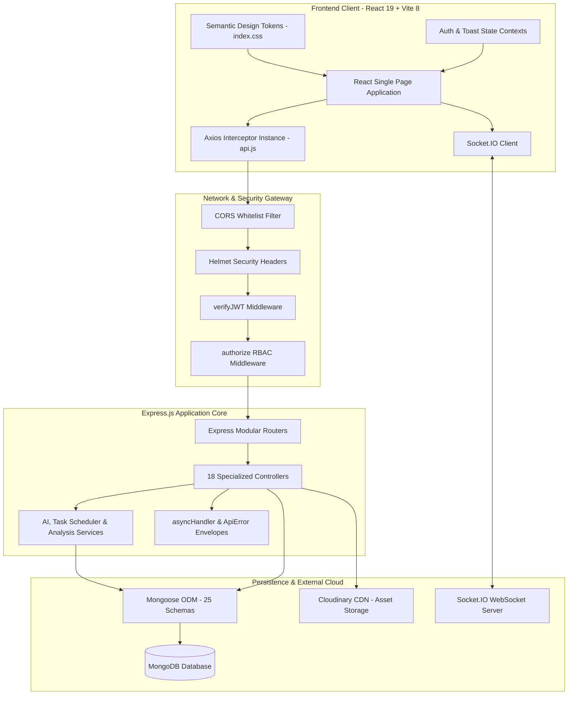
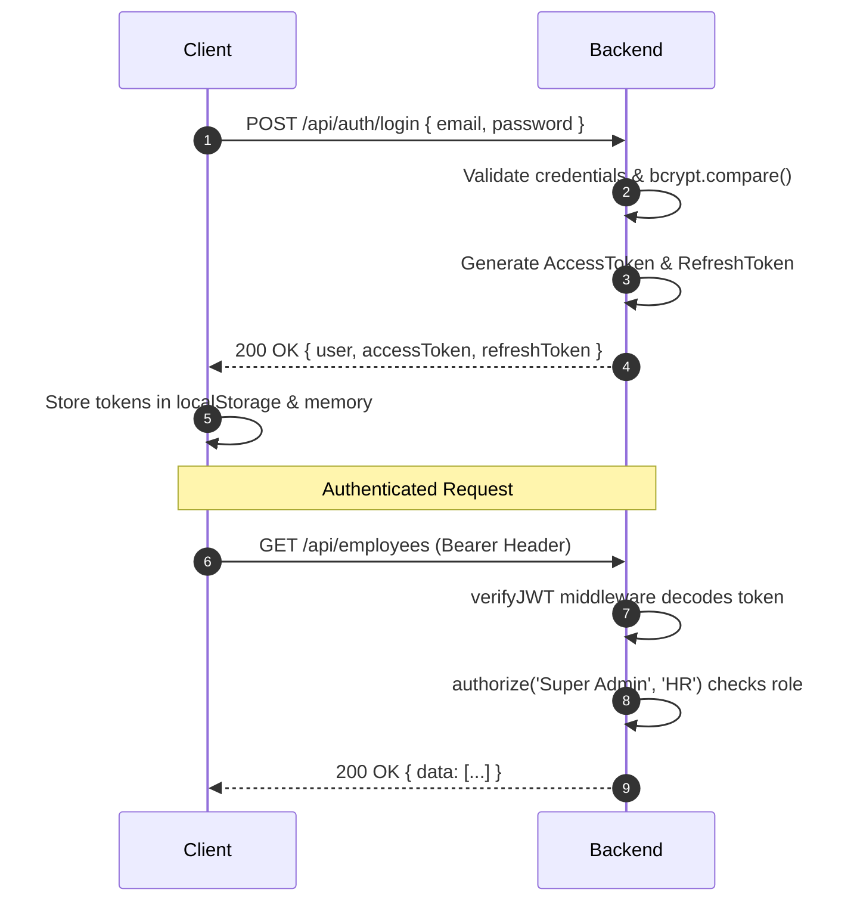

# Enterprise Resource Planning (ERP) Suite

<div align="center">

[](https://nodejs.org/)
[](https://expressjs.com/)
[](https://react.dev/)
[](https://vitejs.dev/)
[](https://www.mongodb.com/)
[](https://socket.io/)
[](https://jwt.io/)
[](https://opensource.org/licenses/MIT)

**An enterprise-grade, full-stack Enterprise Resource Planning (ERP) platform architected for modern organizational operations. Unifies workforce management, project delivery, time tracking, inventory, payroll, and 360° appraisals into an ultra-responsive, dark/light tokenized web experience.**

[Repository](https://github.com/kukharsh144-glitch/Enterprise-Resource-Planning.) • [Frontend Client](./frontend) • [Backend API](./backend)

</div>

---

## 📑 Table of Contents

- [📌 Project Overview](#-project-overview)
- [🎯 Project Objectives](#-project-objectives)
- [✨ Key Features](#-key-features)
- [🏗️ System Architecture](#-system-architecture)
- [📁 Complete Project Structure](#-complete-project-structure)
- [🧩 All ERP Modules](#-all-erp-modules)
- [👥 User Roles & Permissions](#-user-roles--permissions)
- [🔐 Authentication & Authorization](#-authentication--authorization)
- [🗄️ Database Design](#-database-design)
- [📊 Data Models (25 Mongoose Schemas)](#-data-models-25-mongoose-schemas)
- [🎮 Controllers (18 Backend Controllers)](#-controllers-18-backend-controllers)
- [🛣️ Routes & API Reference](#️-routes--api-reference)
- [🛡️ Middleware](#️-middleware)
- [⚠️ Error Handling](#️-error-handling)
- [📝 Logging](#-logging)
- [📦 Dependencies](#-dependencies)
- [⚙️ Environment Variables](#️-environment-variables)
- [💻 Installation & Setup](#-installation--setup)
- [▶️ How to Run the Project](#️-how-to-run-the-project)
- [🔄 Git & GitHub Workflow](#-git--github-workflow)
- [🧪 Testing & Validation](#-testing--validation)
- [📡 API Usage Examples](#-api-usage-examples)
- [🔒 Security Architecture](#-security-architecture)
- [📈 Future Enhancements](#-future-enhancements)
- [🤝 Contribution Guide](#-contribution-guide)
- [📄 License](#-license)
- [👨‍💻 Project Information](#-project-information)

---

## 📌 Project Overview

The **Enterprise Resource Planning (ERP) Suite** is a centralized, distributed software platform designed to manage and automate foundational business operations. Built from the ground up as a high-performance monorepo, the platform bridges real-time database transactions with an executive-grade frontend client.

Unlike cumbersome legacy enterprise applications, this suite emphasizes:
1. **Real-time Collaboration**: WebSocket synchronization across project channels, task allocations, and operational alerts.
2. **Unified Design Language**: Strict CSS design token matrices ensuring flawless visual hierarchy across both Dark and Light modes with zero screen flicker.
3. **Comprehensive Operational Coverage**: Human Resources, Project Management, Inventory Warehousing, Financial Payroll, and Executive Appraisals under a single authentication domain.

---

## 🎯 Project Objectives

- **Operational Consolidation**: Eliminate fragmented SaaS tools by unifying staff records, task boards, shift punch tracking, and leave approvals into one system.
- **Granular Security**: Enforce strict Role-Based Access Control (RBAC) across all REST endpoints and client views.
- **High-Velocity UI/UX**: Provide instant feedback with optimistic state updates, glassmorphic styling, and hardware-accelerated animations.
- **Architectural Scalability**: Maintain modular service layers, isolated controller logic, normalized Mongoose schemas, and automated database index optimization.

---

## ✨ Key Features

- 📊 **Executive Analytics Hub**: Live revenue charts, project health gauges, and departmental capacity metrics.
- 👥 **Workforce & Staff Directory**: Employee database, role assignments, candidate profiles, and new hire registration.
- 📋 **4-Column Kanban Task Board**: Real-time project task board (*To Do*, *In Progress*, *In Review*, *Completed*) with moving dropdowns and priority tagging.
- 🏖️ **Leave Management & Time Off**: Automatic accrual balances (Annual, Sick, Casual), day-count calculators, and manager Approve/Reject controls.
- ⏱️ **Digital Shift Punch Clock**: Live session timer stopwatch, Clock In/Out/Break toggles, weekly project matrix (Mon–Sun), and past timesheet archives.
- 🎯 **Performance & 360° Appraisals**: 4.8/5.0 executive scorecards, 5 core engineering competency meters, active OKR milestones, and peer kudos walls.
- 🤖 **AI Project Planner & WBS**: Automated work breakdown structures, risk matrices, and skill-gap recommendations.
- 📦 **Inventory & Warehouse Ledger**: SKU tracking, valuation metrics, threshold indicators, and stock adjustment dialogs.
- 💳 **Payroll & Earnings Engine**: Automated calculation of base salaries, allowances, tax deductions, and net payouts.
- 🌓 **Synchronized Theme System**: Instant Dark/Light mode switching powered by global semantic tokens and zero-flash prehydration.

---

## 🏗️ System Architecture

### Monorepo Layered Architecture



---

## 📁 Complete Project Structure

```
d:\ERP
├── .gitignore                      # Monorepo gitignore (protects secrets, node_modules, dist)
├── README.md                       # Root comprehensive project documentation
├── backend/                        # Express.js REST API & WebSocket Backend
│   ├── .env.example                # Template for environment configuration
│   ├── .gitignore                  # Backend specific exclusions
│   ├── package.json                # Dependencies and server scripts
│   ├── seed_inventory.js           # Database inventory seeder
│   ├── public/                     # Public static files and diagrams
│   │   └── images/
│   │       └── erp_architecture.jpg
│   └── src/
│       ├── app.js                  # Express app setup, middleware mounting, route bindings
│       ├── constants.js            # Global backend constants and database names
│       ├── index.js                # Server entry point, DB connection, HTTP listener
│       ├── controllers/            # 18 Modular request handlers
│       │   ├── aiProject.controller.js
│       │   ├── asset.controller.js
│       │   ├── auth.controller.js
│       │   ├── customer.controller.js
│       │   ├── dashboard.controller.js
│       │   ├── department.controller.js
│       │   ├── employee.controller.js
│       │   ├── expense.controller.js
│       │   ├── inventory.controller.js
│       │   ├── invoice.controller.js
│       │   ├── leave.controller.js
│       │   ├── order.controller.js
│       │   ├── payroll.controller.js
│       │   ├── product.controller.js
│       │   ├── project.controller.js
│       │   ├── supplier.controller.js
│       │   ├── systemSetting.controller.js
│       │   └── task.controller.js
│       ├── db/                     # Database connection & seed scripts
│       │   ├── DbConnection.js
│       │   ├── seedDashboard.js
│       │   └── tuneStats.js
│       ├── middlewares/            # Security, Auth, Uploads
│       │   ├── auth.middleware.js
│       │   ├── authorization.middleware.js
│       │   └── multer.middleware.js
│       ├── models/                 # 25 Mongoose data schemas
│       │   ├── AIProjectAnalysis.model.js
│       │   ├── ActivityLog.model.js
│       │   ├── Asset.model.js
│       │   ├── Customer.model.js
│       │   ├── Department.model.js
│       │   ├── Employee.model.js
│       │   ├── Expense.model.js
│       │   ├── Inventory.model.js
│       │   ├── Invoice.model.js
│       │   ├── Leave.model.js
│       │   ├── LedgerEntry.model.js
│       │   ├── Notification.model.js
│       │   ├── Order.model.js
│       │   ├── Payroll.model.js
│       │   ├── Product.model.js
│       │   ├── Project.model.js
│       │   ├── ProjectActivity.model.js
│       │   ├── ProjectMember.model.js
│       │   ├── ProjectMessage.model.js
│       │   ├── Report.model.js
│       │   ├── Supplier.model.js
│       │   ├── SystemSetting.model.js
│       │   ├── Task.model.js
│       │   ├── TaskComment.model.js
│       │   └── User.model.js
│       ├── routes/                 # 18 Express API routers
│       │   ├── aiProject.route.js
│       │   ├── asset.route.js
│       │   ├── auth.route.js
│       │   ├── customer.route.js
│       │   ├── dashboard.route.js
│       │   ├── department.route.js
│       │   ├── employee.route.js
│       │   ├── expense.route.js
│       │   ├── inventory.route.js
│       │   ├── invoice.route.js
│       │   ├── leave.route.js
│       │   ├── order.route.js
│       │   ├── payroll.route.js
│       │   ├── product.route.js
│       │   ├── project.route.js
│       │   ├── supplier.route.js
│       │   ├── systemSetting.route.js
│       │   └── task.route.js
│       ├── services/               # Core business services
│       │   ├── ai.service.js
│       │   ├── aiProject.service.js
│       │   ├── dependencyAnalysis.service.js
│       │   ├── projectAnalysis.service.js
│       │   ├── riskAnalysis.service.js
│       │   ├── scheduler.service.js
│       │   ├── taskRecommendation.service.js
│       │   └── teamRecommendation.service.js
│       └── utils/                  # Utility helpers & response envelopes
│           ├── apiError.js
│           ├── apiResponse.js
│           ├── asyncHandler.js
│           ├── cloudinary.js
│           ├── logger.js
│           └── recalculateProject.js
└── frontend/                       # React 19 + Vite 8 SPA Client
    ├── index.html                  # HTML root with zero-flash prehydration
    ├── package.json                # Frontend dependencies
    ├── vite.config.js              # Vite server & proxy configuration
    ├── public/
    │   ├── favicon.svg
    │   └── images/                 # High-resolution documentation banners
    │       ├── erp_frontend_banner.jpg
    │       └── erp_theme_showcase.jpg
    └── src/
        ├── main.jsx                # Application root mounting React
        ├── App.jsx                 # Route definitions & layout wrappers
        ├── index.css               # Global semantic tokens & CSS reset
        ├── App.css                 # Base layout grid styles
        ├── components/
        │   ├── Header.jsx          # Topbar with live Light/Dark switch
        │   ├── Sidebar.jsx         # Navigation menu & shortcuts
        │   ├── GlassToast.jsx      # Glassmorphic toast provider
        │   └── GlassToast.css
        ├── context/
        │   └── AuthContext.jsx     # User authentication state & profile
        ├── services/
        │   └── api.js              # Axios instance with interceptors
        └── pages/
            ├── Dashboard.jsx       # Executive analytics
            ├── Employees.jsx       # Staff directory
            ├── EmployeeProfile.jsx # Candidate details modal
            ├── RegisterEmployee.jsx# Staff onboarding
            ├── Projects.jsx        # Project workstation
            ├── AIPlanner.jsx       # AI WBS decomposition
            ├── TaskBoard.jsx       # 4-Column Kanban board
            ├── LeaveRequests.jsx   # Leave management & balances
            ├── Timesheet.jsx       # Punch clock & hours matrix
            ├── Performance.jsx     # 360° appraisals & OKRs
            ├── Inventory.jsx       # Stock control & warehouse
            ├── Payroll.jsx         # Compensation calculator
            ├── Calendar.jsx        # Company event calendar
            ├── Settings.jsx        # Preferences & configuration
            └── Login.jsx           # Clean authentication
```

---

## 🧩 All ERP Modules

| Module Name | Frontend Route | Backend Base Route | Key Capabilities |
| :--- | :--- | :--- | :--- |
| **Executive Dashboard** | `/`, `/dashboard` | `/api/dashboard` | Real-time business KPIs, financial graphs, ring workload meters, team stream. |
| **Employee Directory** | `/employees` | `/api/employees` | Searchable staff table, role/department filters, candidate profile inspector. |
| **Staff Registration** | `/employees/register` | `/api/employees` | Multi-step employee onboarding form with field validation. |
| **Candidate Profile** | `/employees/:id` | `/api/employees/:id` | Contact info, documents, emergency contacts, project assignments. |
| **Project Workstation** | `/projects` | `/api/projects` | Dedicated workspace, progress bars, budget tracking, phase indicators. |
| **AI Project Planner** | `/ai-planner` | `/api/ai-projects` | Automated Work Breakdown Structure, risk scoring, tech recommendations. |
| **Task Board (Kanban)**| `/tasks`, `/task-board`| `/api/tasks` | 4-column drag/move board, priority tagging, assignee cards, task creation. |
| **Leave Management** | `/leave-requests` | `/api/leaves` | Balance gauges, manager Approve/Reject actions, automatic day calculator. |
| **My Timesheet** | `/timesheet` | `/api/employees/timesheet` | Real-time shift stopwatch, Clock In/Out toggles, weekly project matrix. |
| **Performance & OKRs** | `/performance` | `/api/employees/performance`| 4.8/5.0 scorecard, competency gauges, quarterly OKRs, peer kudos wall. |
| **Inventory Control** | `/inventory` | `/api/inventory`, `/api/products`| SKU tracking, threshold warnings, valuation, instant stock adjusters. |
| **Payroll Engine** | `/payroll` | `/api/payroll` | Base salary, allowances, deductions, net pay statements, status badges. |
| **Operations Calendar** | `/calendar` | `/api/calendar` | Monthly/weekly/daily company event and sprint milestone tracker. |
| **System Settings** | `/settings` | `/api/system-settings` | Role permissions, company metadata, read-only vs editable field persistence. |

---

## 👥 User Roles & Permissions

The system enforces strict Role-Based Access Control (RBAC) across 6 hierarchical roles:

| Module / Action | Super Admin | Admin | Manager | HR | Accountant | Employee |
| :--- | :---: | :---: | :---: | :---: | :---: | :---: |
| **System Settings & Permissions** | ✅ Full | ⚠️ Read | ❌ | ❌ | ❌ | ❌ |
| **Staff Directory & Profiles** | ✅ Full | ✅ Full | ⚠️ Team | ✅ Full | ⚠️ Read | ⚠️ Self |
| **Onboard New Staff** | ✅ | ✅ | ❌ | ✅ | ❌ | ❌ |
| **Projects & Workstations** | ✅ Full | ✅ Full | ✅ Full | ⚠️ Read | ⚠️ Read | ⚠️ Assigned |
| **Task Board & Assignments** | ✅ Full | ✅ Full | ✅ Full | ⚠️ Read | ❌ | ✅ Assigned |
| **Approve / Reject Leaves** | ✅ Full | ✅ Full | ✅ Team | ✅ Full | ❌ | ❌ (Apply only)|
| **Punch Clock & Timesheets** | ✅ Full | ✅ Full | ✅ Review | ⚠️ Read | ⚠️ Read | ✅ Log own |
| **Appraisal Reviews & OKRs** | ✅ Full | ✅ Full | ✅ Review | ✅ Full | ❌ | ⚠️ View own |
| **Inventory & Stock Adjustments**| ✅ Full | ✅ Full | ✅ Write | ❌ | ⚠️ Read | ⚠️ Read |
| **Payroll & Compensation** | ✅ Full | ✅ Full | ❌ | ⚠️ Read | ✅ Full | ⚠️ View own slip |

---

## 🔐 Authentication & Authorization

Authentication is built on dual-token JSON Web Token (JWT) standards:
- **Access Token**: Short-lived (1 day) token stored securely and transmitted via the `Authorization: Bearer <token>` header.
- **Refresh Token**: Long-lived (10 days) token stored in secure, HTTP-only storage for seamless session regeneration.
- **Password Protection**: Passwords are salted and hashed using `bcrypt` (10 rounds) prior to database insertion.



---

## 🗄️ Database Design

The database schema utilizes MongoDB via Mongoose ODM, applying:
- **Index Optimization**: Unique compound indexes on emails, employee IDs, product SKUs, and project keys.
- **Data Normalization**: Relational references (`ref`) for foreign keys (e.g. `Department`, `Employee`, `Project`, `User`).
- **Audit Trails**: Built-in `createdAt`, `updatedAt` timestamps, and an immutable `ActivityLog` collection for compliance auditing.

---

## 📊 Data Models (25 Mongoose Schemas)

1. **`User.model.js`**: Authentication identity, password hash, role (`Super Admin`, `Admin`, `Manager`, `HR`, `Accountant`, `Employee`), avatar URL, refresh tokens.
2. **`Employee.model.js`**: Workforce record, employeeId (`EMP-0001`), department link, designation, salary, emergency contact, date of joining.
3. **`Department.model.js`**: Department naming, code, manager reference, operational budget.
4. **`Project.model.js`**: Project code, name, client, priority, budget, start/end dates, delivery phase, status.
5. **`ProjectMember.model.js`**: Association model between Projects, Employees, and their specific project roles.
6. **`ProjectActivity.model.js`**: Real-time event log of project milestones, updates, and deliverables.
7. **`ProjectMessage.model.js`**: Team chat message stream linked to project workspaces.
8. **`Task.model.js`**: Work ticket, title, project reference, assignee reference, priority, phase, hours estimate, status (*To Do*, *InProgress*, *InReview*, *Completed*).
9. **`TaskComment.model.js`**: Discussion threads attached to specific tasks.
10. **`Leave.model.js`**: Time off record, employee reference, leave type (*Annual*, *Sick*, *Casual*, *Emergency*), date span, duration, reason, status (*Pending*, *Approved*, *Rejected*).
11. **`Payroll.model.js`**: Compensation statement, employeeId, base pay, bonus, deductions, net salary, pay period, disbursement status.
12. **`Inventory.model.js`**: Warehouse stock levels, batch numbering, reorder thresholds, warehouse location.
13. **`Product.model.js`**: SKU catalog, name, cost price, sale price, category, supplier reference.
14. **`Asset.model.js`**: Company physical & digital assets, hardware serials, assigned employee, depreciation.
15. **`Customer.model.js`**: CRM customer profile, company, contact details, payment terms.
16. **`Supplier.model.js`**: Vendor contact details, payment info, supplied product catalog.
17. **`Invoice.model.js`**: Billing invoices, line items, customer link, tax, payment status (*Draft*, *Sent*, *Paid*, *Overdue*).
18. **`Expense.model.js`**: Organizational expenses, category, receipts, authorized by, payment method.
19. **`LedgerEntry.model.js`**: Double-entry bookkeeping ledger tracking debits and credits.
20. **`Notification.model.js`**: User notification queue, type, read status, redirect link.
21. **`SystemSetting.model.js`**: Key-value system configurations, branding, currency, timezone, security policies.
22. **`AIProjectAnalysis.model.js`**: AI generated project breakdown, risk scoring, technical stack suggestions.
23. **`ActivityLog.model.js`**: Immutable audit logs capturing user actions, IP addresses, and timestamps.
24. **`Order.model.js`**: Purchase and sales orders, quantities, fulfillments.
25. **`Report.model.js`**: Historical audit report templates.

---

## 🎮 Controllers (18 Backend Controllers)

1. **`auth.controller.js`**: User registration, credential login, token refreshing, profile updating, logout.
2. **`employee.controller.js`**: Employee CRUD, pagination, department filtering, statistics aggregation.
3. **`department.controller.js`**: Department creation, manager reassignment, budget utilization.
4. **`project.controller.js`**: Project lifecycle, member assignment, milestone tracking, phase recalculation.
5. **`task.controller.js`**: Task creation, Kanban status transitions, assignee filtering, sprint metrics.
6. **`leave.controller.js`**: Leave applications, self-service queries, manager approval/rejection patch operations.
7. **`payroll.controller.js`**: Payroll cycle generation, salary slips, disbursement marking.
8. **`inventory.controller.js`**: Warehouse stock queries, stock adjustments, low-inventory notifications.
9. **`product.controller.js`**: Product SKU management, price adjustments, supplier linking.
10. **`asset.controller.js`**: Hardware asset check-in/out, maintenance schedules, depreciation calculation.
11. **`customer.controller.js`**: Customer onboarding, account balances, transaction histories.
12. **`supplier.controller.js`**: Vendor profiles, supply agreements, order histories.
13. **`invoice.controller.js`**: Invoice generation, itemized totals, payment receipt processing.
14. **`expense.controller.js`**: Operational expense submissions, receipt uploads, approval workflows.
15. **`dashboard.controller.js`**: Real-time aggregation of organizational KPIs, revenue charts, and active counters.
16. **`systemSetting.controller.js`**: System preferences retrieval, configuration key updates.
17. **`aiProject.controller.js`**: AI planning trigger, WBS generation, risk audit evaluations.
18. **`order.controller.js`**: Procurement and client fulfillment order processing.

---

## 🛣️ Routes & API Reference

All backend routes are mounted under the `/api` prefix and require JWT authentication via `verifyJWT`.

### Authentication Routes (`/api/auth`)
| Method | Endpoint | Access | Description |
| :--- | :--- | :--- | :--- |
| `POST` | `/login` | Public | Authenticate user credentials and return JWT tokens |
| `POST` | `/register` | Super Admin | Provision a new administrative or staff account |
| `POST` | `/refresh-token`| Public | Issue a fresh Access Token using a valid Refresh Token |
| `GET` | `/me` | Authenticated | Retrieve profile details of currently logged-in user |
| `POST` | `/logout` | Authenticated | Invalidate refresh tokens and terminate session |

### Employee Routes (`/api/employees`)
| Method | Endpoint | Access | Description |
| :--- | :--- | :--- | :--- |
| `GET` | `/` | All Authenticated | Paginated employee list with department/role filters |
| `POST` | `/` | Admin, HR | Register a new employee with designated salary and role |
| `GET` | `/:id` | All Authenticated | Fetch comprehensive profile of a specific employee |
| `PATCH` | `/:id` | Admin, HR | Update employee details, department, or compensation |
| `DELETE`| `/:id` | Super Admin | Soft-delete / deactivate an employee account |

### Task Routes (`/api/tasks`)
| Method | Endpoint | Access | Description |
| :--- | :--- | :--- | :--- |
| `GET` | `/` | All Authenticated | Retrieve tasks filtered by project, assignee, or priority |
| `POST` | `/` | All Authenticated | Create a new task ticket and assign to an employee |
| `PATCH` | `/:id/status` | All Authenticated | Move task status (*To Do* ➔ *InProgress* ➔ *Completed*) |
| `DELETE`| `/:id` | Admin, Manager | Remove a task ticket |

### Leave Management Routes (`/api/leaves`)
| Method | Endpoint | Access | Description |
| :--- | :--- | :--- | :--- |
| `GET` | `/my` | All Authenticated | Fetch logged-in user's own leave application history |
| `GET` | `/` | Admin, HR, Manager | Retrieve all team leave requests with status filters |
| `POST` | `/` | All Authenticated | Submit a new leave application with date range & reason |
| `PATCH` | `/:id/status` | Admin, HR, Manager | Approve or Reject a submitted leave application |

### Project Routes (`/api/projects`)
| Method | Endpoint | Access | Description |
| :--- | :--- | :--- | :--- |
| `GET` | `/` | All Authenticated | List active projects with progress and budget metrics |
| `POST` | `/` | Admin, Manager | Initialize a new project and configure milestone delivery |
| `GET` | `/:id` | All Authenticated | Retrieve project workstation details and member list |

---

## 🛡️ Middleware

- **`verifyJWT` (`auth.middleware.js`)**: Decodes the Bearer token from the `Authorization` header, queries the user record, and attaches `req.user` to the request pipeline.
- **`authorize(...roles)` (`authorization.middleware.js`)**: Validates that `req.user.role` matches the allowed roles for the given route; raises `403 Forbidden` if unauthorized.
- **`upload` (`multer.middleware.js`)**: Handles multi-part file uploads (avatars, documents, expense receipts) with disk buffering before pushing to Cloudinary CDN.
- **`errorHandler` (`app.js`)**: Catches all downstream errors and formats them into standard `ApiError` JSON envelopes.

---

## ⚠️ Error Handling

All controller errors are normalized using the standard `ApiError` class:

```javascript
// backend/src/utils/apiError.js
export class ApiError extends Error {
  constructor(statusCode, message = "Something went wrong", errors = [], stack = "") {
    super(message);
    this.statusCode = statusCode;
    this.data = null;
    this.success = false;
    this.errors = errors;
  }
}
```

Controller routines are wrapped in `asyncHandler`, eliminating repetitive `try-catch` blocks:

```javascript
// Example Usage in Controllers
export const getTaskById = asyncHandler(async (req, res) => {
  const task = await Task.findById(req.params.id);
  if (!task) throw new ApiError(404, "Task ticket not found");
  return res.status(200).json(new ApiResponse(200, task, "Task retrieved successfully"));
});
```

---

## 📝 Logging

- **HTTP Request Logger**: `morgan` formats incoming HTTP method, URL, status code, and latency in development mode.
- **Application Logger (`logger.js`)**: Timestamped internal errors, database connectivity notices, and socket connection events.
- **Security Audit Logs (`ActivityLog.model.js`)**: Sensitive mutations (salary adjustments, role promotions, account deactivations) are persisted directly to MongoDB with the actor's IP address.

---

## 📦 Dependencies

### Backend Dependencies (`backend/package.json`)
| Package | Version | Purpose |
| :--- | :--- | :--- |
| `express` | `^5.2.1` | REST API web server framework |
| `mongoose` | `^9.9.3` | MongoDB Object Data Modeling (ODM) |
| `jsonwebtoken` | `^9.0.3` | Cryptographic JWT token generation and verification |
| `bcrypt` | `^6.0.0` | Password hashing and salt rounds |
| `socket.io` | `^4.8.3` | Real-time WebSocket communication |
| `helmet` | `^8.3.0` | HTTP security headers |
| `cors` | `^2.8.6` | Cross-Origin Resource Sharing control |
| `multer` | `^2.2.0` | Multipart file upload parsing |
| `cloudinary` | `^2.10.1` | Cloud media storage and transformations |
| `dotenv` | `^17.4.2` | Environment configuration loading |

### Frontend Dependencies (`frontend/package.json`)
| Package | Version | Purpose |
| :--- | :--- | :--- |
| `react` | `^19.2.8` | Component rendering engine |
| `react-dom` | `^19.2.8` | DOM manipulation layer |
| `react-router-dom`| `^7.18.2` | Client-side routing & protected route layouts |
| `vite` | `^8.2.2` | Next-generation frontend bundler & dev server |
| `axios` | `^1.19.0` | Promise-based HTTP client with request interceptors |
| `lucide-react` | `^1.34.0` | Modern SVG iconography |
| `recharts` | `^3.10.1` | Composable SVG data visualization charts |
| `socket.io-client`| `^4.8.3` | Client-side WebSocket listener |

---

## ⚙️ Environment Variables

### Backend Configuration (`backend/.env`)

Copy `backend/.env.example` to `backend/.env`:

```env
# Server Port
PORT=7000

# Database
MONGODB_URI=mongodb://localhost:27017/erp

# Cross-Origin Whitelist
CORS_ORIGIN=http://localhost:5173

# JWT Credentials
ACCESS_TOKEN_SECRET=your_super_secret_access_key_123456
ACCESS_TOKEN_EXPIRY=1d
REFRESH_TOKEN_SECRET=your_super_secret_refresh_key_123456
REFRESH_TOKEN_EXPIRY=10d

# Cloudinary CDN (Optional for File Uploads)
CLOUDINARY_CLOUD_NAME=your_cloud_name
CLOUDINARY_API_KEY=your_cloudinary_key
CLOUDINARY_API_SECRET=your_cloudinary_secret
```

### Frontend Configuration (`frontend/.env`)

```env
VITE_API_BASE_URL=http://localhost:7000/api
```

---

## 💻 Installation & Setup

### 1. Clone the Repository
```bash
git clone https://github.com/kukharsh144-glitch/Enterprise-Resource-Planning..git
cd Enterprise-Resource-Planning.
```

### 2. Configure Backend
```bash
cd backend
npm install
cp .env.example .env    # Configure your MongoDB URI and JWT secrets
```

### 3. Configure Frontend
```bash
cd ../frontend
npm install
```

---

## ▶️ How to Run the Project

### Running Backend Server
```bash
cd backend
npm run dev
```
*Backend runs at:* **`http://localhost:7000`**

### Running Frontend Client
```bash
cd frontend
npm run dev
```
*Frontend runs at:* **`http://localhost:5173`**

---

## 🔄 Git & GitHub Workflow

1. **Branching Model**:
   - `main`: Production-ready releases.
   - `feature/<feature-name>`: Modular additions (e.g. `feature/timesheet-matrix`).
   - `fix/<bug-name>`: Targeted bug fixes.
2. **Commit Conventions (Conventional Commits)**:
   - `feat:` New features or UI additions.
   - `fix:` Bug fixes or schema corrections.
   - `docs:` Documentation improvements.
   - `refactor:` Code restructuring without functional changes.
3. **Pull Request Protocol**:
   - Verify `npm run build` passes with zero errors before opening a PR.

---

## 🧪 Testing & Validation

- **Frontend Bundle Validation**:
  ```bash
  cd frontend
  npm run build
  ```
  Ensures all JSX components, Lucide icons, and Recharts elements compile with **0 errors**.

- **API Health Check**:
  ```bash
  curl -X GET http://localhost:7000/api/dashboard/stats/overview
  ```

---

## 📡 API Usage Examples

### 1. Staff Authentication (`POST /api/auth/login`)
```bash
curl -X POST http://localhost:7000/api/auth/login \
  -H "Content-Type: application/json" \
  -d '{
    "email": "harsh@example.com",
    "password": "Password@123"
  }'
```

**Response (`200 OK`):**
```json
{
  "statusCode": 200,
  "data": {
    "user": {
      "_id": "66dd9f81a1b2c3d4e5f67890",
      "fullName": "Harsh Saini",
      "email": "harsh@example.com",
      "role": "Super Admin"
    },
    "accessToken": "eyJhbGciOiJIUzI1NiIsInR5cCI6IkpXVCJ9...",
    "refreshToken": "eyJhbGciOiJIUzI1NiIsInR5cCI6IkpXVCJ9..."
  },
  "message": "User logged in successfully",
  "success": true
}
```

### 2. Apply for Time Off (`POST /api/leaves`)
```bash
curl -X POST http://localhost:7000/api/leaves \
  -H "Content-Type: application/json" \
  -H "Authorization: Bearer <your_access_token>" \
  -d '{
    "leaveType": "Annual Leave",
    "startDate": "2026-09-18",
    "endDate": "2026-09-22",
    "reason": "Annual family vacation"
  }'
```

---

## 🔒 Security Architecture

- **Token Safety**: Access tokens are kept in short-lived sessions; refresh tokens enable silent rotation.
- **Cross-Origin Protection**: Strict CORS whitelisting preventing unauthorized domains from querying backend resources.
- **HTTP Header Hardening**: Powered by `helmet` to mitigate Cross-Site Scripting (XSS), Clickjacking, and MIME-sniffing.
- **Injection Mitigation**: Mongoose schema sanitization blocks malicious MongoDB operator injection payloads.

---

## 📈 Future Enhancements

- 📱 **Mobile Application**: React Native companion app for mobile shift punches and instant push alerts.
- 🔗 **Third-Party Webhooks**: Automated integrations with Slack channels, GitHub commits, and Stripe invoicing.
- 🏢 **Multi-Tenant SaaS Isolation**: Tenant schema multiplexing allowing multiple enterprises on a single cluster.
- 📑 **Automated PDF Generation**: Server-side PDF rendering for official payslips and tax deduction certificates.

---

## 🤝 Contribution Guide

1. Fork the Project repository.
2. Create your Feature Branch (`git checkout -b feature/AmazingFeature`).
3. Commit your changes (`git commit -m 'feat: add AmazingFeature'`).
4. Push to the branch (`git push origin feature/AmazingFeature`).
5. Open a Pull Request for review.

---

## 📄 License

Distributed under the **MIT License**. See `LICENSE` for more information.

---

## 👨‍💻 Project Information

- **Author**: Harsh Saini
- **GitHub**: [@kukharsh144-glitch](https://github.com/kukharsh144-glitch)
- **Repository**: [https://github.com/kukharsh144-glitch/Enterprise-Resource-Planning.](https://github.com/kukharsh144-glitch/Enterprise-Resource-Planning.)

<div align="center">

Crafted with excellence for modern enterprise operations.

</div>
