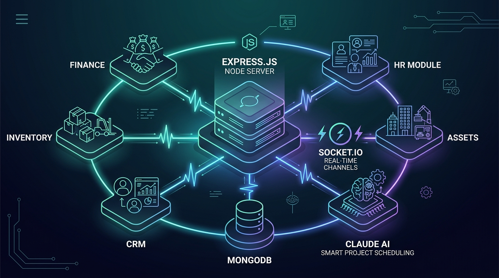
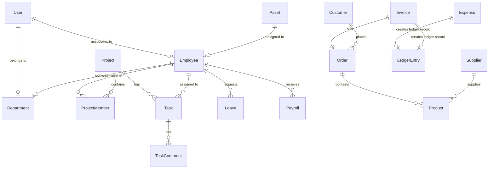
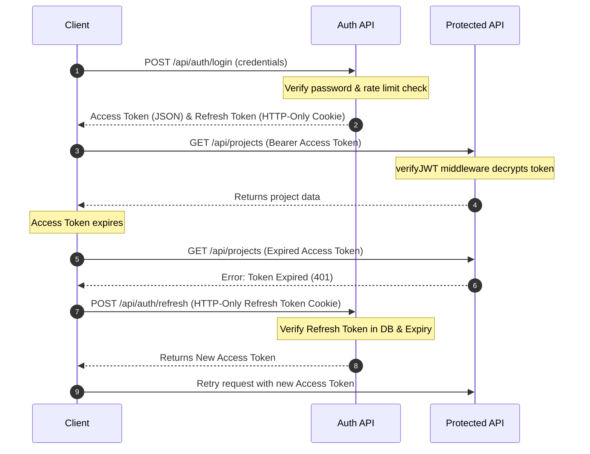
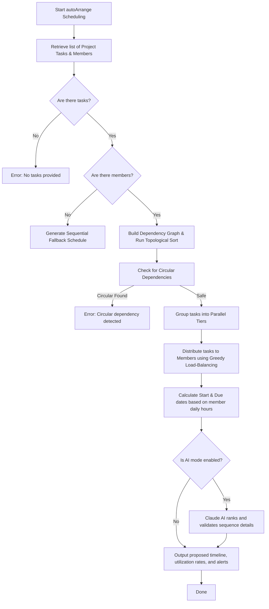

# Enterprise Resource Planning (ERP) System - Backend API

Welcome to the backend API of the **Enterprise Resource Planning (ERP)** system. This is a production-grade, highly modular, and feature-rich ERP server built with **Node.js**, **Express.js**, **MongoDB**, and **Socket.io**. It is designed to serve as the single source of truth for modern business operations, integrating HR, Payroll, Project Management, Assets, CRM, Inventory, Sales, Procurement, and Financial Accounting into a unified platform.



In addition to core modules, the system integrates **Claude AI** for intelligent project breakdown generation and includes an advanced **Topological-Sort-based Task Auto-Scheduler** that optimizes work distribution and resolves task dependencies against team capacities.

---

## 📊 System Flow Diagrams & Architecture

To help developers visualize the system internals, here are detailed flow and relationship diagrams mapping out key components of the ERP backend:

### 1. Database Entity-Relationship (ER) Schema
This simplified ER diagram shows how the core collections are linked via references in MongoDB:



---

### 2. Secure JWT Authentication & Refresh Flow
The authentication flow utilizes short-lived access keys and database-validated refresh keys for secure, stateless sessions:



---

### 3. Intelligent Task Auto-Scheduling Pipeline
This diagram explains the core operations of the auto-arrange scheduling engine ([scheduler.service.js](file:///d:/ERP/backend/src/services/scheduler.service.js)):



---

## 🏗️ Architecture & Design Patterns

The project follows a robust **MVC (Model-View-Controller)** pattern adapted for REST APIs:

```
d:/ERP/backend/
├── src/
│   ├── db/                 # Database connection logic
│   ├── models/             # Mongoose schemas/data models (23 models)
│   ├── controllers/        # Business logic controllers (15 controllers)
│   ├── routes/             # Express routes defining API endpoints (15 modules)
│   ├── middlewares/        # Authentication, authorization, and sanitization guards
│   ├── services/           # AI planning and scheduling engines
│   ├── utils/              # Calculation helpers, response formatting, loggers
│   ├── app.js              # Express app definition & Socket.io configuration
│   └── index.js            # Server entry point
├── public/                 # Local directory for temporary file uploads
├── postman/                # Collection files for testing API endpoints
├── .env                    # Environment configuration
├── package.json            # Dependencies and scripts
└── README.md               # Backend documentation
```

### Key Architectural highlights:
* **Separation of Concerns**: Business logic is isolated in controllers, data schemas in models, routing in routes, and cross-cutting concerns (such as security, role enforcement, and rate-limiting) in middlewares.
* **Real-time Synchronization**: Integrated with **Socket.io** to enable instant notifications, real-time collaboration updates, and chat rooms (e.g., project-specific join/leave scopes).
* **AI-Assisted Operations**: Combines deterministic algorithms (Topological Sort) with generative AI (Claude 3.5 Sonnet) to create project schedules and estimate task complexity.

---

## 🛠️ Technology Stack

* **Runtime**: [Node.js](https://nodejs.org/) (ES Modules configuration)
* **Framework**: [Express.js](https://expressjs.com/) (version 5.x)
* **Database**: [MongoDB](https://www.mongodb.com/) (using [Mongoose ODM](https://mongoosejs.com/))
* **Real-time Server**: [Socket.io](https://socket.io/) (v4.x)
* **Security & Defense**:
  * [Helmet](https://helmetjs.github.io/) for setting secure HTTP headers
  * [CORS](https://github.com/expressjs/cors) for Cross-Origin Resource Sharing control
  * [Cookie-Parser](https://github.com/expressjs/cookie-parser) for signed access tokens
  * In-memory Rate-limiting for brute-force prevention on authentication routes
  * Custom XSS Input Sanitization middleware (stripping `<script>` elements and `on*` events)
  * Custom CSRF validation
* **Authentication**: JWT (JSON Web Tokens) with asymmetric secret configuration, deploying short-lived Access Tokens (15m/1d) and secure HTTP-Only Refresh Tokens (10d).
* **Media Uploads**: [Multer](https://github.com/expressjs/multer) local disk-storage coupled with [Cloudinary API Integration](https://cloudinary.com/) for media storage.
* **Logging**: Structured JSON logger outputting logs with timestamps and severity classification (`info`, `warn`, `error`).

---

## 🔒 Security & RBAC (Role-Based Access Control)

The system enforces strict **Role-Based Access Control (RBAC)** down to the module-action level. Security is handled by the unified [auth.middleware.js](file:///d:/ERP/backend/src/middlewares/auth.middleware.js).

### Roles defined in the system:
1. **Super Admin**: Full permissions across all modules and destructive actions (delete).
2. **Admin**: Operational management of users, employees, projects, payroll, and inventory.
3. **Manager**: Team oversight, project planning, task assignment, inventory updates, and leave approvals.
4. **HR**: Full employee lifecycle, recruitment, department structures, leave management, and payroll initialization.
5. **Accountant**: Financial assets, depreciation calculations, invoices, expenses, payroll execution, and ledger reporting.
6. **Employee**: Personal tasks, leave applications, product catalogs, and assigned project resources.

### Permission Matrix (Example snippet):
| Module | Action | Allowed Roles |
| :--- | :--- | :--- |
| **users** | Create/Update | Super Admin, Admin |
| **employees** | Create/Update/Read | Super Admin, Admin, HR (Read also open to Manager, Accountant) |
| **projects** | Create | Super Admin, Admin, Manager, HR |
| **projects** | Update/Assign | Super Admin, Admin, Manager |
| **payroll** | Create/Update | Super Admin, Admin, HR, Accountant |
| **leaves** | Approve | Super Admin, Admin, Manager, HR |
| **inventory** | Create/Update | Super Admin, Admin, Manager |
| **accounting**| Create/Update | Super Admin, Admin, Accountant |

---

## 🧩 Core Modules & Key Features

### 1. User & Authentication Module
* **Path**: `/api/auth`
* **Controller**: [`auth.controller.js`](file:///d:/ERP/backend/src/controllers/auth.controller.js)
* **Model**: [`User.model.js`](file:///d:/ERP/backend/src/models/User.model.js)
* **Capabilities**: Registration, role assignment, login (with password verification via `bcrypt` and login rate-limiting), logout, and JWT refresh token rotation. It generates secure authorization cookies.

### 2. Human Resources (HR) & Department Module
* **Paths**: `/api/employees`, `/api/departments`
* **Controllers**: [`employee.controller.js`](file:///d:/ERP/backend/src/controllers/employee.controller.js), [`department.controller.js`](file:///d:/ERP/backend/src/controllers/department.controller.js)
* **Models**: [`Employee.model.js`](file:///d:/ERP/backend/src/models/Employee.model.js), [`Department.model.js`](file:///d:/ERP/backend/src/models/Department.model.js)
* **Capabilities**: Comprehensive management of personnel records, profile fields, weekly work capacity in hours, and department hierarchy. Handles the assignment of heads of departments (HODs) and calculates operational payroll.

### 3. Project & Task Management (with AI auto-scheduling)
* **Paths**: `/api/projects`, `/api/tasks`
* **Controllers**: [`project.controller.js`](file:///d:/ERP/backend/src/controllers/project.controller.js), [`task.controller.js`](file:///d:/ERP/backend/src/controllers/task.controller.js)
* **Models**: [`Project.model.js`](file:///d:/ERP/backend/src/models/Project.model.js), [`Task.model.js`](file:///d:/ERP/backend/src/models/Task.model.js), [`ProjectMember.model.js`](file:///d:/ERP/backend/src/models/ProjectMember.model.js), [`TaskComment.model.js`](file:///d:/ERP/backend/src/models/TaskComment.model.js)
* **Capabilities**:
  * **Dynamic Task Breakdown**: Create tasks with titles, estimated/actual hours, weights, due dates, and strict task dependencies.
  * **Project Recalculation**: Automates updating project completion percentages, start dates, and end dates whenever a child task is added, deleted, or updated in status ([recalculateProject.js](file:///d:/ERP/backend/src/utils/recalculateProject.js)).
  * **AI Planning**: Integrated with Claude AI to analyze project requirements and generate a comprehensive task list with weightages and priorities ([ai.service.js](file:///d:/ERP/backend/src/services/ai.service.js)).
  * **Auto-Arrange Engine**: A sophisticated task scheduling service that takes task dependencies, team member allocations, daily capacity hours, and due dates to propose an optimized timeline. It runs a **topological sort algorithm** to prevent out-of-order execution, distributes task weights evenly, and flags overloading alerts if utilization exceeds 80% ([scheduler.service.js](file:///d:/ERP/backend/src/services/scheduler.service.js)).

### 4. Financial & Asset Management
* **Path**: `/api/assets`
* **Controller**: [`asset.controller.js`](file:///d:/ERP/backend/src/controllers/asset.controller.js)
* **Model**: [`Asset.model.js`](file:///d:/ERP/backend/src/models/Asset.model.js)
* **Helper Utilities**: [`utils-for-assets.js`](file:///d:/ERP/backend/src/utils/utils-for-assets.js)
* **Capabilities**:
  * **Depreciation Engine**: Supports Straight-Line, Declining-Balance, and Units-of-Production methods to automatically calculate accumulated depreciation, book value, and percentage depreciated.
  * **Warranty & Maintenance Tracking**: Monitors warranty expiry, schedules routine checkups, calculates remaining days, and flags overdue maintenance.
  * **Asset Allocation**: Records when hardware/software assets are assigned to employees, logging complete asset-state transitions (`Available` ➡️ `Assigned` ➡️ `Maintenance` ➡️ `Retired`).

### 5. Leave & Payroll Processing
* **Paths**: `/api/leaves`, `/api/payroll`
* **Controllers**: [`leave.controller.js`](file:///d:/ERP/backend/src/controllers/leave.controller.js), [`payroll.controller.js`](file:///d:/ERP/backend/src/controllers/payroll.controller.js)
* **Models**: [`Leave.model.js`](file:///d:/ERP/backend/src/models/Leave.model.js), [`Payroll.model.js`](file:///d:/ERP/backend/src/models/Payroll.model.js)
* **Capabilities**: Leave application submission, tracking accrued balance, and a multi-level approval pipeline. Payroll tracks allowances, deductions, taxes, and net salary.

### 6. Sales, Billing & Accounting
* **Paths**: `/api/invoices`, `/api/expenses`, `/api/orders`
* **Controllers**: [`invoice.controller.js`](file:///d:/ERP/backend/src/controllers/invoice.controller.js), [`expense.controller.js`](file:///d:/ERP/backend/src/controllers/expense.controller.js), [`order.controller.js`](file:///d:/ERP/backend/src/controllers/order.controller.js)
* **Models**: [`Invoice.model.js`](file:///d:/ERP/backend/src/models/Invoice.model.js), [`Expense.model.js`](file:///d:/ERP/backend/src/models/Expense.model.js), [`Order.model.js`](file:///d:/ERP/backend/src/models/Order.model.js), [`LedgerEntry.model.js`](file:///d:/ERP/backend/src/models/LedgerEntry.model.js)
* **Capabilities**: Tracks sales orders, generates customer invoices, maintains transaction logs via Ledger entries for accounting validation, and records operational expenses.

### 7. Inventory & Procurement Management
* **Paths**: `/api/inventory`, `/api/products`, `/api/suppliers`
* **Controllers**: [`inventory.controller.js`](file:///d:/ERP/backend/src/controllers/inventory.controller.js), [`product.controller.js`](file:///d:/ERP/backend/src/controllers/product.controller.js), [`supplier.controller.js`](file:///d:/ERP/backend/src/controllers/supplier.controller.js)
* **Models**: [`Inventory.model.js`](file:///d:/ERP/backend/src/models/Inventory.model.js), [`Product.model.js`](file:///d:/ERP/backend/src/models/Product.model.js), [`Supplier.model.js`](file:///d:/ERP/backend/src/models/Supplier.model.js)
* **Capabilities**: Products catalog control, live stock levels, procurement reorder thresholds, supplier database tracking, and automatic safety alerts for low stock items.

---

## 📁 Detailed Database Schemas (Mongoose Models)

All schemas are declared under [`src/models/`](file:///d:/ERP/backend/src/models/) and utilize compound indexes, reference validations, and pre-save hooks:

1. **`User`**: Core login credentials, secure password hash, active state, two-factor secret, and role details.
2. **`Employee`**: Personal profile, department, designation, salary band, and weekly work hours.
3. **`Department`**: Department name, unique code, cost center metadata, and HOD reference.
4. **`Project`**: Title, timeline dates, current status, client, total estimated hours, and final completion percentage.
5. **`ProjectMember`**: Maps employees to projects with their specific percentage allocations and project-specific roles.
6. **`Task`**: Single action unit linked to a project and assigned employee. Includes priority, complexity weight (1-10 points), estimated/actual hours, due date validation, status pre-save hooks, and a dependencies array linking to parent/related tasks.
7. **`TaskComment`**: Message boards for tasks.
8. **`Leave`**: Leave type (Casual, Sick, Earned, Unpaid), start/end dates, total days, reason, and approval logs.
9. **`Payroll`**: Aggregated monthly payroll details containing base pay, allowances (HRA, DA), deductions (PF, Tax), and payout status.
10. **`Asset`**: Hardware/software record containing manufacturer details, serial number, cost, purchase date, useful life, depreciation type, warranty expiry, and assignment status.
11. **`Customer`**: CRM profile containing company name, primary contacts, and sales lifecycle status (Lead, Opportunity, Customer).
12. **`Product`**: SKU details, description, categories, unit prices, and supplier reference.
13. **`Inventory`**: Stock balances, warehouse locations, and automated reorder triggers.
14. **`Order`**: Client purchases, billing address, items grid, shipping status, and tax totals.
15. **`Invoice`**: Payment demands mapped to orders/clients, recording payments made and balance due.
16. **`Expense`**: Corporate expenses mapping amount, date, and payment status to Ledger categories.
17. **`Supplier`**: Procurement suppliers registry tracking lead time, rating, and contact information.
18. **`LedgerEntry`**: Double-entry bookkeeping ledger logs, mapping transaction flows.
19. **`Notification`**: Real-time user alert records.
20. **`ActivityLog`**: System audit trails logging operations, actor, timestamp, and metadata.
21. **`ProjectActivity`**: Stream of events occurring inside a project scope.
22. **`ProjectMessage`**: Chat messages inside project collaborative workspaces.
23. **`Report`**: Generated business sheets metadata (e.g., Financial statements, HR census).

---

## ⚙️ Setup & Installation

Follow these steps to configure and boot the ERP backend API on your local machine:

### 1. Prerequisites
* **Node.js**: Ensure Node.js (v18.x or above) is installed.
* **MongoDB**: A local MongoDB Community server running or an active MongoDB Atlas cluster URI.
* **Cloudinary**: Active Cloudinary account credentials for file uploads (optional, fallback to local path if disabled).
* **Anthropic SDK**: An Anthropic Claude API Key for project planning and scheduler enhancements.

### 2. Clone and Install Dependencies
Navigate into the `backend/` project directory and run standard npm installations:
```bash
cd backend
npm install
```

### 3. Environment Configuration
Create a `.env` file in the root of the `backend/` folder (refer to [`.env`](file:///d:/ERP/backend/.env)) and declare the following variables:

```ini
PORT=8000
MONGODB_URI=your_mongodb_connection_uri
CORS_ORIGIN=*

# JWT Authentication Config
ACCESS_TOKEN_SECRET=your_long_random_jwt_access_secret_string
ACCESS_TOKEN_EXPIRY=1d
REFRESH_TOKEN_SECRET=your_long_random_jwt_refresh_secret_string
REFRESH_TOKEN_EXPIRY=10d

# Cloudinary Storage Configuration
CLOUDINARY_CLOUD_NAME=your_cloudinary_cloud_name
CLOUDINARY_API_KEY=your_cloudinary_api_key
CLOUDINARY_API_SECRET=your_cloudinary_api_secret

# AI Plan Generation Key (Anthropic Claude API Key)
ANTHROPIC_API_KEY=your_anthropic_api_key
```

### 4. Launching the Server
The system uses `nodemon` to watch for local modifications during development.

To start the server in **Development Mode**:
```bash
npm run dev
```

The console should display the following connection logs:
```
⚙️ Server is running at port : 8000
MongoDB connected: <database_host_ip>
```

---

## 🔌 API Route Map

All API endpoints are prefixed with `/api`. Enforced routes require the client to supply a valid JWT access token as a bearer header or HTTP cookie.

| Category | Endpoint Prefix | Main Controller File |
| :--- | :--- | :--- |
| **Authentication** | `/api/auth` | [`auth.controller.js`](file:///d:/ERP/backend/src/controllers/auth.controller.js) |
| **HR Employees** | `/api/employees` | [`employee.controller.js`](file:///d:/ERP/backend/src/controllers/employee.controller.js) |
| **Departments** | `/api/departments` | [`department.controller.js`](file:///d:/ERP/backend/src/controllers/department.controller.js) |
| **Projects** | `/api/projects` | [`project.controller.js`](file:///d:/ERP/backend/src/controllers/project.controller.js) |
| **Tasks** | `/api/tasks` | [`task.controller.js`](file:///d:/ERP/backend/src/controllers/task.controller.js) |
| **Leaves** | `/api/leaves` | [`leave.controller.js`](file:///d:/ERP/backend/src/controllers/leave.controller.js) |
| **Assets** | `/api/assets` | [`asset.controller.js`](file:///d:/ERP/backend/src/controllers/asset.controller.js) |
| **Payroll** | `/api/payroll` | [`payroll.controller.js`](file:///d:/ERP/backend/src/controllers/payroll.controller.js) |
| **CRM Customers**| `/api/customers` | [`customer.controller.js`](file:///d:/ERP/backend/src/controllers/customer.controller.js) |
| **Inventory** | `/api/inventory` | [`inventory.controller.js`](file:///d:/ERP/backend/src/controllers/inventory.controller.js) |
| **Sales Orders** | `/api/orders` | [`order.controller.js`](file:///d:/ERP/backend/src/controllers/order.controller.js) |
| **Products** | `/api/products` | [`product.controller.js`](file:///d:/ERP/backend/src/controllers/product.controller.js) |
| **Suppliers** | `/api/suppliers` | [`supplier.controller.js`](file:///d:/ERP/backend/src/controllers/supplier.controller.js) |
| **Invoices** | `/api/invoices` | [`invoice.controller.js`](file:///d:/ERP/backend/src/controllers/invoice.controller.js) |
| **Expenses** | `/api/expenses` | [`expense.controller.js`](file:///d:/ERP/backend/src/controllers/expense.controller.js) |
| **System Health**| `/api/health` | Inline checker (returns status `ok`) |

---

## ⚡ Real-Time Collaboration & Sockets

The backend exposes real-time messaging tunnels via Socket.io. Clients can connect to:
* **`project:join` (payload: `projectId`)**: Join a collaborative room scoped to a specific project. Enables live updates on tasks and progress tracking.
* **`project:leave` (payload: `projectId`)**: Leave the collaborative workspace.
* Broadcast events are emitted for real-time task creations, project updates, and team notifications.
