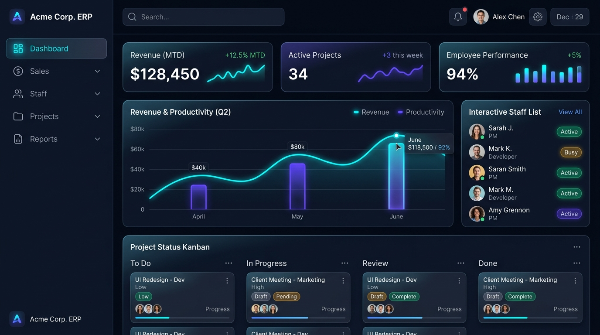
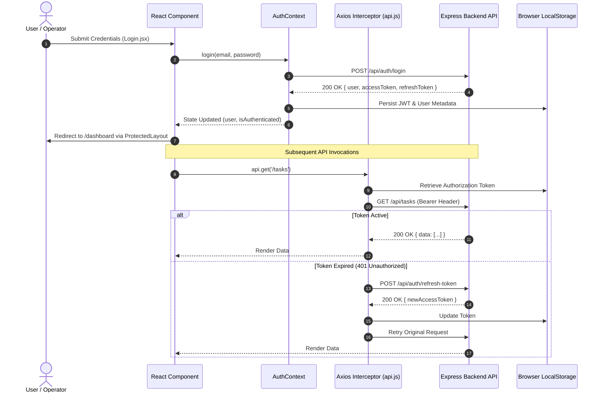
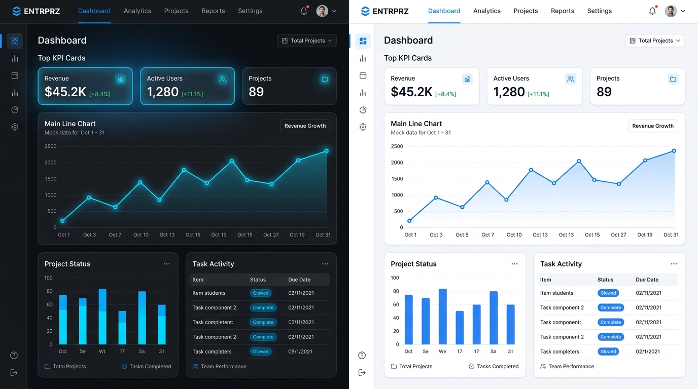

# Enterprise Resource Planning (ERP) — Frontend Client



<div align="center">

[](https://react.dev/)
[](https://vitejs.dev/)
[](https://developer.mozilla.org/en-US/docs/Web/JavaScript)
[](https://developer.mozilla.org/en-US/docs/Web/CSS)
[](https://lucide.dev/)
[](https://recharts.org/)

**A modern, executive-grade Enterprise Resource Planning frontend client built with React 18, Vite, and a synchronized Dark/Light design token architecture.**

[Key Modules](#-key-modules--features) • [Application Architecture](#-application-architecture) • [Design System](#-design-system--token-matrix) • [Directory Structure](#-directory-structure) • [Setup & Development](#-setup--development)

</div>

---

## 📖 Executive Summary

The **Enterprise Resource Planning (ERP) Frontend Client** is a workstation-grade Single Page Application (SPA) designed to unify mission-critical business operations into an intuitive, ultra-responsive web interface.

Eliminating clunky legacy enterprise software aesthetics, this application leverages:
- **Glassmorphic Depth & Micro-interactions**: Translucent surfaces, glowing accents, and smooth hardware-accelerated CSS transitions.
- **Zero-Dependency Styling**: Pure, semantic Vanilla CSS design tokens with instant theme switching (Dark & Light) and zero flash of unstyled content (FOUC).
- **High-Density Data Presentation**: Responsive data grids, interactive Kanban workflows, digital shift timers, and SVG-based KPI metric gauges.
- **Resilient Offline-First UX**: Graceful mock fallbacks ensuring that all views and interactive workflows remain fully functional even in demo or offline modes.

---

## 🏛️ Application Architecture

The frontend follows a unidirectional data flow powered by React Context, React Router v6, and Axios interceptors for authenticated API interactions.

### 1. High-Level Component & Routing Hierarchy

```mermaid
graph TD
    App[App.jsx Root Router] --> AuthProvider[AuthContext.jsx]
    AuthProvider --> ToastSystem[GlassToastContainer]
    
    AuthProvider --> AnonymousLayout[Anonymous Layout]
    AnonymousLayout --> LoginPage[Login.jsx]
    
    AuthProvider --> ProtectedLayout[Protected Route Layout]
    
    ProtectedLayout --> Sidebar[Sidebar.jsx Navigation]
    ProtectedLayout --> Header[Header.jsx Topbar & Theme Switcher]
    ProtectedLayout --> MainContent[Main Content Canvas]
    
    MainContent --> Dashboard[Dashboard.jsx - Executive Analytics]
    MainContent --> Employees[Employees.jsx - Staff Management]
    MainContent --> EmployeeProfile[EmployeeProfile.jsx - Candidate View]
    MainContent --> RegisterEmp[RegisterEmployee.jsx - Onboarding]
    MainContent --> Projects[Projects.jsx - Dedicated Workstation]
    MainContent --> AIPlanner[AIPlanner.jsx - AI Project WBS]
    MainContent --> Inventory[Inventory.jsx - Stock & Ledger]
    MainContent --> Payroll[Payroll.jsx - Compensation Engine]
    MainContent --> Calendar[Calendar.jsx - Operations Schedule]
    MainContent --> TaskBoard[TaskBoard.jsx - 4-Column Kanban]
    MainContent --> LeaveRequests[LeaveRequests.jsx - Time Off Approvals]
    MainContent --> Timesheet[Timesheet.jsx - Digital Punch Clock]
    MainContent --> Performance[Performance.jsx - 360° Appraisals]
    MainContent --> Settings[Settings.jsx - System Preferences]
```



---

### 2. Client-Server Authentication & Request Flow



---

## 🎨 Design System & Token Matrix

The application features a standardized, accessible color system that guarantees high contrast, visual rhythm, and instant Light/Dark mode toggling.



### Zero-Flash Prehydration
To prevent screen flash during initial page load, a lightweight prehydration script runs in `index.html` before React or CSS styles are evaluated:

```html
<script>
  (function() {
    try {
      var t = localStorage.getItem('theme') || 'dark';
      document.documentElement.setAttribute('data-theme', t);
    } catch (e) {}
  })();
</script>
```

### Global Token Reference Table

| Token Name | Light Mode (`:root`) | Dark Mode (`[data-theme="dark"]`) | Purpose / Usage |
| :--- | :--- | :--- | :--- |
| `--bg-app` | `#f1f5f9` (Slate 100) | `#090d16` (Deep Obsidian) | Application canvas background |
| `--bg-card` | `rgba(255, 255, 255, 0.95)` | `rgba(15, 23, 42, 0.68)` | Cards, tables, widget panels |
| `--bg-card-hover` | `#ffffff` | `rgba(255, 255, 255, 0.04)` | Hover state for interactive cards |
| `--bg-sidebar` | `#0f1424` (Executive Navy) | `#080b12` (Onyx Black) | Left persistent navigation bar |
| `--bg-header` | `rgba(255, 255, 255, 0.88)` | `rgba(9, 13, 22, 0.85)` | Sticky header with backdrop blur |
| `--text-primary` | `#0f172a` (Slate 900) | `#f8fafc` (Slate 50) | Primary headings, table data, titles |
| `--text-secondary` | `#334155` (Slate 700) | `#cbd5e1` (Slate 300) | Subtitles, labels, descriptions |
| `--text-muted` | `#64748b` (Slate 500) | `#94a3b8` (Slate 400) | Timestamps, metadata, placeholders |
| `--border-default` | `rgba(0, 0, 0, 0.10)` | `rgba(255, 255, 255, 0.08)` | Container borders, table row dividers |
| `--border-strong` | `rgba(0, 0, 0, 0.18)` | `rgba(255, 255, 255, 0.16)` | Modal borders, active card strokes |
| `--input-bg` | `#ffffff` | `rgba(255, 255, 255, 0.05)` | Text inputs, dropdown selects, textareas |
| `--color-primary` | `#2563eb` (Royal Blue) | `#3b82f6` (Vibrant Blue) | Primary CTAs, active indicators, highlights |
| `--color-success` | `#059669` (Emerald) | `#10b981` (Vibrant Emerald) | Approved states, online pills, positive deltas |
| `--color-warning` | `#d97706` (Amber) | `#f59e0b` (Vibrant Amber) | Pending reviews, warnings, mid priority |
| `--color-danger` | `#dc2626` (Crimson) | `#ef4444` (Vibrant Red) | Rejected leaves, errors, critical priority |

---

## 🚀 Key Modules & Features

### 1. Executive Dashboard (`/`, `/dashboard`)
- **Metric Cards**: Real-time KPI summaries for Net Revenue, Active Headcount, Active Projects, and System Health with percentage trend chips.
- **Recharts Financial Trends**: Interactive dual-axis Area & Bar charts depicting monthly revenue trajectory, burn rates, and forecast projections.
- **Team Workload Ring Gauges**: Visual circular progress rings representing departmental capacity and delivery velocity.
- **Collaborative Team Stream**: Embedded live team discussion widget with instant messaging simulation and message status pills.

### 2. Employee Management (`/employees`, `/employees/:id`, `/employees/register`)
- **Directory Table**: High-density table showing employee names, IDs (`EMP-0001`), roles, departments, salary brackets, and active status pills.
- **Live Search & Filters**: Multi-attribute filtering by department (Engineering, Design, Marketing, Sales), role, and employment status.
- **Candidate Profile View**: Dedicated modal showcasing full candidate metadata, contact details, emergency contacts, skills, compensation breakdown, and assigned projects.
- **Employee Registration**: Form with validation for onboarding new staff members directly into the database.

### 3. Task Board (`/tasks`, `/task-board`)
- **4-Column Kanban Pipeline**: Visual stages for **To Do**, **In Progress**, **In Review**, and **Completed**.
- **Interactive Task Moving**: Quick status dropdown selectors on every card allowing instant movement between columns with toast feedback.
- **Search & Priority Filtering**: Filter tasks by title, assignee, or priority level (**Critical**, **High**, **Medium**, **Low**).
- **"+ Create Task" Modal**: Dialog to log new tasks with assigned projects, phase tags, estimated hours, and due dates, wired to `/api/tasks`.

### 4. Leave Requests & Time Off (`/leave-requests`)
- **Accrual Balance Strip**: Visual metric cards for **Annual Leave** (14/20 days), **Sick Leave** (8/10 days), **Casual Leave** (4/6 days), and **Pending Review** count.
- **Approval Workflow**: Manager-level instant **Approve** (check) and **Reject** (cross) action buttons with database patch mutations and toast updates.
- **Filter Tabs**: Instant sorting between *All Requests*, *Pending Review (3)*, *Approved*, and *Past History*.
- **"+ Apply for Leave" Modal**: Comprehensive form featuring automatic duration calculation between start and end dates, leave type selection, reason notes, and emergency handover contact inputs.

### 5. My Timesheet & Shift Sessions (`/timesheet`)
- **Live Digital Punch Clock**: Real-time ticking clock with visual session status indicators (*Active On Duty*, *On Break*, *Clocked Out*).
- **Session Stop Watch**: Live working duration counter (`HH:MM:SS`) with interactive *Clock In / Clock Out* and *Take Break / Resume* controls.
- **Weekly Matrix Grid (Mon - Sun)**: Project-by-project daily hours log with real-time horizontal row summation and vertical daily column aggregates.
- **Submission & Save Draft**: Actions to save timesheets locally or submit them for managerial payroll sign-off.
- **Past Timesheet Archive**: History table of previous pay cycles with regular hours, overtime, approval status, and approver details.

### 6. Performance & Career Growth (`/performance`)
- **Executive Appraisal Scorecard**: Overall score of **4.8 / 5.0** (*Exceeds Expectations* gold badge), **88% OKR completion**, and **Q3 2026 Evaluation Cycle**.
- **Core Engineering Competency Gauges**: Visual meters evaluating Technical Architecture (96%), Code Quality (94%), Mentorship (88%), Cross-functional Collaboration (90%), and Reliability (92%).
- **Active OKRs & Milestones**: Filterable quarterly objectives with progress bars, weightings, due dates, and direct progress updating.
- **360° Peer Feedback Wall**: Colleague testimonials with role badges, star ratings, and peer recognition accolades (*Design Token Hero*, *System Architect*, *DevOps Champion*).

### 7. Projects & AI Planner (`/projects`, `/ai-planner`)
- **Dedicated Project Workstation**: Full-viewport immersive workspace designed for deep project management.
- **Project Cards**: Budget utilization bars, delivery phase tags, and member avatar stacks.
- **AI Intelligence Suite**: Automated Work Breakdown Structure (WBS), risk matrix analysis, required skill gap auditing, and automated team recommendations.

### 8. Inventory & Stock Control (`/inventory`)
- **SKU & Stock Management**: Real-time product inventory tracking with quantity warning thresholds.
- **Financial Stock Valuation**: Total stock value metrics and low-stock replenishment alert badges.
- **Interactive Stock Adjusters**: Direct modal adjustments for inbound shipments, write-offs, and transfers.

### 9. Payroll & Compensation (`/payroll`)
- **Salary Computation Engine**: Automated base salary, allowances, tax deductions, and net payouts.
- **Direct Slip View**: Breakdown of employee earnings statements with payment status tags.

### 10. Operations Calendar (`/calendar`)
- **Timeline & Event Scheduling**: Month, week, and day grid views tracking company holidays, project sprints, sprint reviews, and departmental syncs.

### 11. System Settings & Profile (`/settings`)
- **Enterprise Configuration**: System parameters, timezone, currency, and role-based access rules.
- **Editable vs Read-Only Logic**: Visual distinction between immutable system fields and editable preferences with live database sync.

### 12. Glass Toast Notification Engine (`GlassToast.jsx`)
- **Event-Driven Feedback**: Zero-dependency notification provider supporting `success`, `error`, `warning`, and `info` toasts.
- **Smart Stacking & Dismissal**: Automatic 4-second timeout with manual dismiss buttons and pause-on-hover capability.

---

## 📁 Directory Structure

```
d:\ERP\frontend
├── index.html                  # Main HTML entry with zero-flash theme prehydration script
├── package.json                # Project dependencies and script declarations
├── vite.config.js              # Vite bundler configuration & backend API proxy
├── public/                     # Static public assets
│   ├── favicon.svg             # ERP platform favicon
│   ├── icons.svg               # SVG sprite definitions
│   └── images/                 # High-resolution documentation and showcase images
│       ├── erp_frontend_banner.jpg
│       └── erp_theme_showcase.jpg
└── src/
    ├── main.jsx                # Application root mounting React DOM
    ├── App.jsx                 # Routing configuration & protected layout wrappers
    ├── index.css               # Global CSS design tokens, typography, & reset
    ├── App.css                 # Application layout styles (sidebar + header + main)
    ├── assets/                 # SVGs and static component graphics
    ├── context/
    │   └── AuthContext.jsx     # Authentication state, login/logout, user profile
    ├── services/
    │   └── api.js              # Axios instance with request/response JWT interceptors
    ├── components/
    │   ├── Header.jsx          # Sticky top navigation bar with live theme toggle
    │   ├── Sidebar.jsx         # Persistent left menu with navigation & shortcuts
    │   ├── GlassToast.jsx      # Glassmorphic toast notification component
    │   └── GlassToast.css      # Toast animations and theme token styling
    └── pages/
        ├── Login.jsx           # Clean authentication page
        ├── Dashboard.jsx       # Executive analytics dashboard
        ├── DashboardLux.css    # Dashboard-specific glassmorphic styles
        ├── Employees.jsx       # Employee directory with search & filters
        ├── EmployeeProfile.jsx # Detailed candidate profile modal & view
        ├── RegisterEmployee.jsx# Onboarding form for new staff
        ├── Projects.jsx        # Dedicated full-screen project workstation
        ├── ProjectsLux.css     # Project workstation styling
        ├── AIPlanner.jsx       # AI project decomposition & risk auditor
        ├── AIProjectDashboard.jsx# AI project analytics & dependency visualizer
        ├── Inventory.jsx       # Inventory control & stock ledger
        ├── InventoryLux.css    # Inventory table & modal styling
        ├── Payroll.jsx         # Compensation & payroll engine
        ├── Calendar.jsx        # Company events and sprint schedule calendar
        ├── TaskBoard.jsx       # 4-Column interactive Kanban task board
        ├── LeaveRequests.jsx   # Leave management, balances & approvals
        ├── Timesheet.jsx       # Shift punch clock & weekly hours matrix
        ├── Performance.jsx     # 360° appraisal scorecard & OKR tracking
        └── Settings.jsx        # System settings & database-backed preferences
```

---

## ⚡ Setup & Development

### 1. Prerequisites
Ensure you have the following installed:
- **Node.js**: `v18.0.0` or higher
- **npm**: `v9.0.0` or higher

### 2. Installation
Clone the repository and install frontend dependencies:

```bash
# Navigate to the frontend directory
cd frontend

# Install dependencies cleanly
npm install
```

### 3. Environment Configuration
Create a `.env` file in `frontend/` (optional, as Vite defaults to port `7000` via proxy):

```env
VITE_API_BASE_URL=http://localhost:7000/api
```

### 4. Running Locally
Start the Vite development server with Hot Module Replacement (HMR):

```bash
npm run dev
```

The application will be accessible at: **`http://localhost:5173`**

### 5. Production Build & Validation
To compile and bundle the application for production deployment:

```bash
# Run the Vite production build
npm run build

# Preview the production bundle locally
npm run preview
```

The production output will be generated cleanly in `dist/` with optimized chunking and minified assets.

---

## 🛡️ Best Practices & Quality Standards

- **Accessible Colors**: Every text/background combination conforms to WCAG 2.1 AA contrast ratios in both Dark and Light modes.
- **Component Modularity**: Every page and widget encapsulates its own layout logic while consuming shared global theme tokens.
- **Keyboard Navigation**: Modals, dropdowns, and buttons support standard keyboard controls (`Escape` to close, `Tab` focus rings, `Enter` to submit).
- **Responsive Layout**: Fluid CSS grid and flexbox containers ensure seamless presentation from large 4K ultrawide monitors down to standard laptop viewports.

---

<div align="center">

**Enterprise Resource Planning (ERP) Suite** • Crafted with precision, performance, and modern design standards.

</div>
